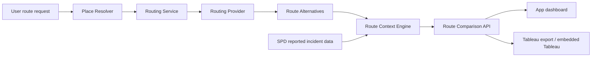

# Live Route Alternatives Architecture Design

## Purpose

The Waypoint dashboard should give users agency after showing reported incident context. A user
should be able to enter an origin, destination, travel mode, and departure window, then compare
realistic route alternatives. The product must remain careful: it compares reported incident context
and route tradeoffs, but it does not label a route safe or unsafe.

This design makes route alternatives a first-class backend concept. Tableau remains a visualization
and comparison layer that consumes prepared route, geometry, and context data from the app.

## Product Goals

- Let users compare plausible route options for a commute or routine trip.
- Support public/community use without requiring Google Timeline data.
- Preserve the advanced Google Timeline import path as a separate option.
- Build toward OpenTripPlanner as the long-term public-ready routing provider.
- Keep route safety language contextual, not prescriptive.

## Non-Goals

- Do not promise a safest route.
- Do not provide emergency, real-time threat, or personal safety instructions.
- Do not make Tableau responsible for generating routes.
- Do not require a paid maps provider as the long-term foundation.
- Do not ingest exact home/work addresses unless the user explicitly chooses that level of detail.

## User Flow

The first-screen options remain:

1. Build My Routine
2. Explore a Route
3. Advanced Import

For Explore a Route, the user enters:

- origin as a neighborhood, landmark, cross street, transit stop, or optional exact address,
- destination using the same input types,
- mode: transit, walk, bike, drive, or mixed,
- departure or arrival window,
- optional preferences such as fewer transfers, less walking, or compare time windows.

The app returns a comparison view with route alternatives. Each route card shows:

- route label,
- estimated duration,
- travel mode mix,
- transfer count,
- walking distance when available,
- major stops, transfers, or segments,
- reported incident context near route parts for the selected time/date range,
- assumptions and caveats.

The language should use patterns like:

> This option has fewer reported incidents near transfer and waiting areas during the selected
> weekday morning window, based on available reported data.

The language must not say:

> This is the safest route.

## Architecture



### Place Resolver

The place resolver converts user text into coordinates or generalized areas. It should support:

- neighborhoods,
- landmarks,
- cross streets,
- transit stops,
- exact addresses when explicitly entered.

The resolver returns both an analysis location and a display location. For privacy, the display
location can be generalized even when an exact input is used for routing.

### Routing Service

The routing service owns the internal contract:

```text
RouteRequest -> list[RouteAlternative]
```

It validates the request, calls the configured routing provider, normalizes provider-specific
responses, and returns provider-neutral route alternatives to the rest of the app.

The dashboard and Tableau export must depend on the provider-neutral route model, not on
OpenTripPlanner or Google-specific response shapes.

### Routing Provider Interface

The provider interface should allow these implementations:

- local/mock provider for development and tests,
- OpenTripPlanner provider for the long-term open-data path,
- optional Google provider if a fast external prototype is needed later.

Provider responses must include enough data for comparison:

- route geometry or segment geometry,
- start and end locations,
- steps or segments,
- transit stop and transfer details when available,
- duration and distance metrics,
- provider metadata and caveats.

### OpenTripPlanner Direction

OpenTripPlanner is the intended public-ready provider. It can use OpenStreetMap for street, walk,
and bike networks plus GTFS transit schedules for public transit. Seattle-region feeds can come from
King County Metro and Sound Transit. GTFS-realtime can be added later for arrivals, vehicle positions,
and service alerts.

The app should treat OpenTripPlanner as a separate service dependency, not as code embedded inside
the FastAPI app. FastAPI calls the OTP API and stores normalized route results.

### Route Context Engine

The route context engine overlays reported incident data onto each route alternative. It should
summarize reported incidents around:

- origin area,
- destination area,
- transit stops,
- transfer and waiting areas,
- walking connectors,
- route corridor segments.

The MVP can start with point-based summaries around route stops and endpoints, then add segment or
corridor buffers later.

### Data Model Additions

The implementation should add route-oriented records instead of forcing route data into place
clusters:

- `route_requests`: user, origin/destination labels, resolved coordinates or area ids, mode,
  departure/arrival window, preferences, privacy level, provider.
- `route_alternatives`: request id, provider route id, route label, duration, distance, transfer
  count, mode mix, summary geometry, rank/order, provider metadata.
- `route_segments`: route alternative id, sequence, segment type, mode, start/end coordinates,
  distance, duration, stop/transfer labels, encoded geometry.
- `route_context_summaries`: route alternative id, optional segment id, radius or buffer settings,
  date range, time window, grouped reported incident counts, nearest incident distance, normalized
  comparison metrics.

Existing `PlaceCluster` and `PlaceCrimeSummary` models stay in place for uploaded timelines,
routine places, and Tableau-safe place summaries. Route comparisons use their own route tables and
can export a separate Tableau dataset.

### Tableau Handoff

The backend should prepare Tableau-ready route comparison exports:

- route alternatives CSV,
- route segments CSV,
- route context summaries CSV,
- route geometry as line-ready fields or GeoJSON where appropriate.

Embedded Tableau consumes these prepared datasets to show:

- side-by-side route cards,
- route map with lines, endpoints, stops, and transfer points,
- incident context by route part,
- time-window filters,
- mode and provider assumptions.

Tableau should not call OpenTripPlanner directly.

## API Shape

Initial API endpoints:

```text
POST /routes/resolve
POST /routes/alternatives
GET /routes/requests/{request_id}
GET /routes/requests/{request_id}/comparison
GET /exports/tableau/route-alternatives.csv
GET /exports/tableau/route-segments.csv
GET /exports/tableau/route-context.csv
```

`POST /routes/alternatives` should return the route alternatives immediately for a fast provider.
If OpenTripPlanner graph builds or downstream context summaries become slow, the same contract can
be adapted to an asynchronous job later.

## Privacy And Safety Language

The product should:

- describe data as reported incidents, not danger,
- avoid safe, unsafe, dangerous, avoid this route, and take this route language,
- show caveats about missing, delayed, corrected, and geographically generalized crime data,
- let users generalize display locations,
- avoid exporting raw exact user-entered addresses by default,
- preserve a no-personal-data route exploration mode.

The strongest acceptable recommendation pattern is comparative:

> Compared with the first option, this alternative has fewer reported incidents near transfer areas
> during the selected time window, but it adds one transfer and about 10 minutes.

## Staged Build Plan

### Stage 1: Contract And Mock Provider

Add route schemas, persistence, API endpoints, and a deterministic mock provider with Seattle sample
routes. This proves the user flow, context model, and Tableau export shape without requiring an OTP
deployment.

### Stage 2: Route Context Summaries

Summarize reported incident context around endpoints, stops, transfers, and walking connectors. Start
with point-radius summaries. Add segment/corridor buffers later.

### Stage 3: Tableau Route Exports

Add Tableau-ready CSV exports for route alternatives, segments, and route context. Embedded Tableau
can then visualize side-by-side comparison views.

### Stage 4: OpenTripPlanner Provider

Run OpenTripPlanner as a separate service using OpenStreetMap and Seattle-region GTFS feeds. Add a
provider adapter that converts OTP itineraries into the provider-neutral route model.

### Stage 5: Realtime Transit Enhancements

Add GTFS-realtime feeds for trip updates, vehicle positions, and service alerts after the static
route comparison flow works.

## Testing Strategy

- Unit test place resolution rules with generalized and exact inputs.
- Unit test routing provider normalization with mock provider fixtures.
- Unit test route context summaries around stops and endpoints.
- API test the route alternatives flow from request through comparison response.
- Export test Tableau CSV headers and route rows.
- Keep OpenTripPlanner integration tests optional or marked so local unit tests do not require OTP.

## Implementation Planning Decisions

- Stage 1 should create database tables immediately. Persistence is needed for comparison responses,
  Tableau exports, and later provider swaps.
- The mock provider should start with three Seattle sample routes: Capitol Hill to Downtown,
  Rainier Valley to Downtown, and Ballard to University District.
- Place resolution should begin with a local Seattle fixture for neighborhoods, known landmarks, and
  selected transit stops. External geocoding should be a later adapter, not a Stage 1 dependency.
- Route context summaries should introduce route-specific pure summary functions. They may reuse
  shared distance helpers, but they should not force route segments into place-cluster abstractions.
